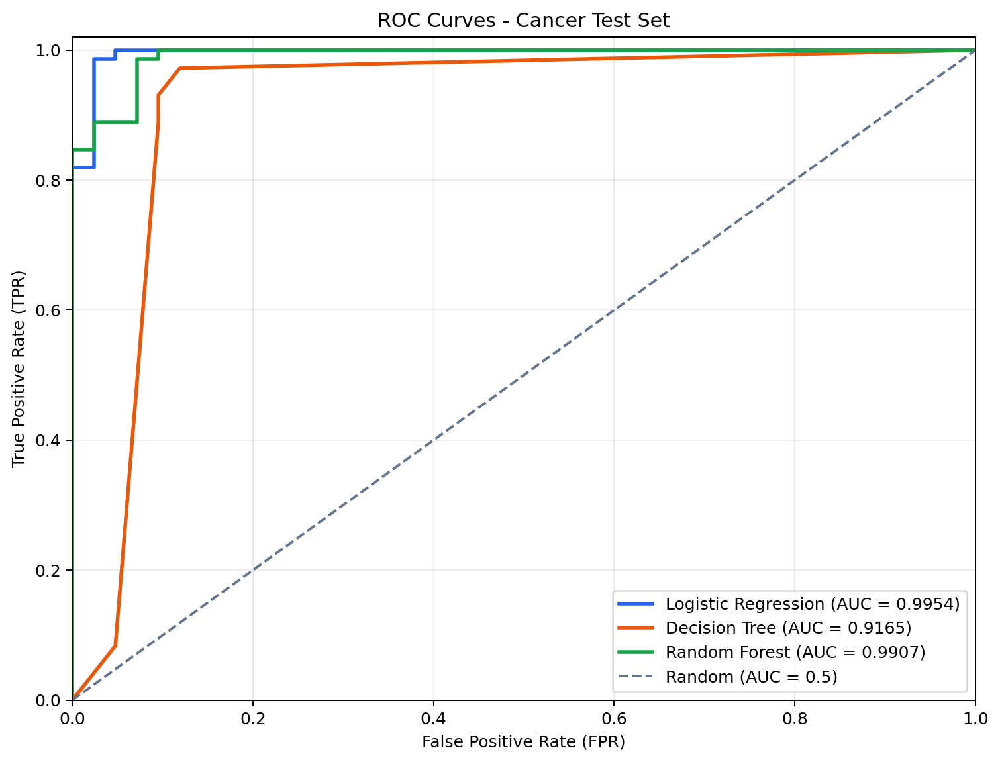
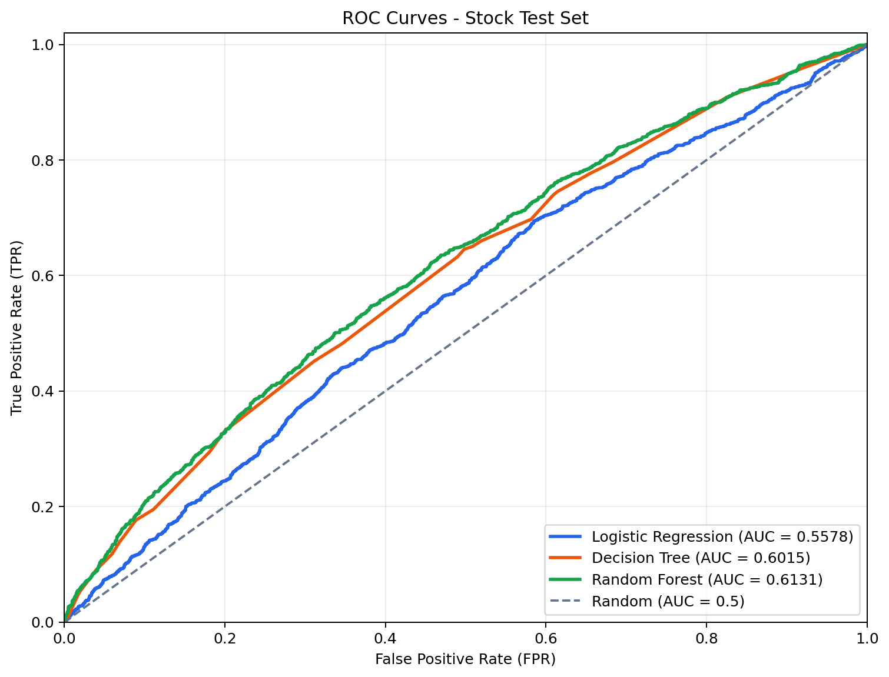

# TASK5：分类模型、评价指标与 ROC/AUC 实验

## 1. 分类型机器学习算法

分类模型用于预测离散类别。本次任务是二分类问题，应变量只有 0 和 1。模型并不只是给出最终类别，还可以先输出“属于类别 1 的概率”，再通过阈值将概率转成 0 或 1。例如默认阈值为 0.5 时，预测概率不小于 0.5 就判为 1。

### 1.1 逻辑回归（Logistic Regression）

逻辑回归虽然名称中有“回归”，实际是经典分类算法。它先计算特征的线性组合：

```text
z = b0 + b1*x1 + b2*x2 + ... + bn*xn
```

再通过 Sigmoid 函数将结果压缩到 0～1：

```text
P(Y=1|X) = 1 / (1 + exp(-z))
```

所得数值可以解释为样本属于类别 1 的估计概率。逻辑回归速度快、结果稳定，系数方向也较容易解释，适合作为分类任务的基线模型。它的主要限制是默认形成线性决策边界；当特征与类别之间存在复杂的非线性关系时，表达能力可能不足。不同特征的数量级差异还会影响模型优化，因此本次实验在逻辑回归前进行了标准化。

### 1.2 决策树（Decision Tree）

决策树通过一系列“如果……那么……”的规则完成分类。例如模型可以先判断“某个半径是否大于一个阈值”，再对子样本继续寻找新的切分条件。每次切分通常希望让子节点中的类别更纯，常用的纯度指标有基尼不纯度和信息熵。

决策树能处理非线性关系和特征交互，不要求特征标准化，规则也便于展示。但单棵树容易把训练样本中的噪声当成规律，产生过拟合。本次使用 `max_depth=5` 和 `min_samples_leaf=5` 限制树的复杂度。

### 1.3 随机森林（Random Forest）

随机森林是由许多决策树组成的集成模型，主要包含两层随机性：

1. 每棵树从训练集中有放回地抽取一批样本；
2. 每个节点只从随机选取的一部分特征中寻找最佳切分。

分类时，多棵树通过投票或平均预测概率给出最终结果。不同树犯错的方向不完全相同，组合后通常能降低单棵树的方差，泛化能力也更稳定。随机森林能够拟合非线性关系，对异常值和特征尺度较不敏感，但训练和预测开销较大，整体规则也不如单棵树直观。本次建立了 300 棵树。

## 2. 模型评价指标

### 2.1 混淆矩阵

混淆矩阵比较真实类别和预测类别：

| 真实类别 / 预测类别 | 预测为 0 | 预测为 1 |
| --- | ---: | ---: |
| 真实为 0 | TN：真负例 | FP：假正例 |
| 真实为 1 | FN：假负例 | TP：真正例 |

- TP：真实为 1，模型也预测为 1；
- TN：真实为 0，模型也预测为 0；
- FP：真实为 0，却被错误预测为 1；
- FN：真实为 1，却被错误预测为 0。

由此可以得到：

```text
Accuracy  = (TP + TN) / (TP + TN + FP + FN)
Precision = TP / (TP + FP)
Recall    = TP / (TP + FN)
F1        = 2 * Precision * Recall / (Precision + Recall)
FPR       = FP / (FP + TN)
```

准确率表示总体预测正确的比例；精确率回答“预测为 1 的样本中有多少确实为 1”；召回率又称 TPR 或敏感度，回答“所有真实为 1 的样本中找出了多少”。类别很不平衡时，准确率可能产生误导，应结合混淆矩阵、召回率、F1 和 AUC 判断。

### 2.2 ROC 曲线

模型输出概率后，可以尝试从 1 到 0 的不同分类阈值。每个阈值都会得到一个 TPR 和 FPR，把横轴 FPR、纵轴 TPR 的点连接起来就是 ROC（Receiver Operating Characteristic）曲线。

曲线越靠近左上角越好，表示模型能获得较高的真正例率，同时保持较低的假正例率。对角线代表接近随机猜测的分类器。ROC 展示的是模型在所有阈值下的整体区分能力，而不是只评价默认的 0.5 阈值。

### 2.3 AUC

AUC（Area Under the ROC Curve）是 ROC 曲线下的面积。它还可以理解为：随机抽取一个正类样本和一个负类样本时，模型将正类样本排在负类样本之前的概率。

- AUC = 1：排序完全正确；
- AUC = 0.5：与随机排序相当；
- AUC < 0.5：预测方向可能反了；
- AUC 越大，模型区分正负类别的能力通常越强。

AUC 不依赖某一个固定分类阈值，但它不能代替业务阈值的选择。在极度不平衡的数据中还应观察 Precision-Recall 曲线，并结合 FP 和 FN 的实际成本选阈值。

## 3. Python 实现与实验设置

程序文件为 `analyze_classification.py`，默认读取 `model_data_cancer.csv`。该数据共有 569 个样本、27 个数值特征，标签分布为 0 类 212 个、1 类 357 个。在原始数据定义中，`0 = malignant（恶性）`，`1 = benign（良性）`，因此本次 ROC/AUC 的正类是良性类别 1。

实验步骤如下：

1. 读取 CSV 并将应变量检查、转换为 0/1；
2. 使用分层随机抽样划分 80% 训练集和 20% 测试集，固定 `random_state=42`；
3. 在训练流程内使用中位数填补缺失值，避免测试集信息泄漏；
4. 逻辑回归额外进行标准化，决策树和随机森林直接使用原始尺度；
5. 仅使用训练集拟合模型；
6. 在测试集计算准确率、精确率、召回率、F1、混淆矩阵和 AUC，并绘制 ROC 曲线。

默认运行：

```bash
python TASK5/analyze_classification.py
```

切换到股票收益分类数据：

```bash
python TASK5/analyze_classification.py --dataset stock
```

自定义测试集比例或输入文件：

```bash
python TASK5/analyze_classification.py --test-size 0.25 --random-state 123
python TASK5/analyze_classification.py --dataset cancer --data-file TASK5/model_data_cancer.csv
```

## 4. 乳腺癌数据测试结果

训练集 455 条、测试集 114 条。测试集结果如下：

| 模型 | Accuracy | Precision | Recall | F1 | AUC |
| --- | ---: | ---: | ---: | ---: | ---: |
| 逻辑回归 | 0.9737 | 0.9859 | 0.9722 | 0.9790 | **0.9954** |
| 随机森林 | 0.9386 | 0.9577 | 0.9444 | 0.9510 | 0.9907 |
| 决策树 | 0.9386 | 0.9333 | 0.9722 | 0.9524 | 0.9165 |

混淆矩阵的四个计数为：

| 模型 | TN | FP | FN | TP |
| --- | ---: | ---: | ---: | ---: |
| 逻辑回归 | 41 | 1 | 2 | 70 |
| 决策树 | 37 | 5 | 2 | 70 |
| 随机森林 | 39 | 3 | 4 | 68 |

逻辑回归的 AUC 最高，为 0.9954，说明它几乎能将类别 1 样本排在类别 0 样本之前。随机森林的 AUC 也达到 0.9907。单棵决策树在默认概率输出下只有有限个概率档位，ROC 曲线更粗，AUC 为 0.9165，但在 0.5 阈值下的准确率仍达到 0.9386。由此也可以看出：某一个阈值下的准确率与所有阈值下的排序能力是两个不同角度，不能互相替代。



## 5. 股票数据补充实验

程序也在 `model_data_stock.csv` 上完成了相同流程。该数据共有 20772 条记录、17 个连续特征；日期和股票代码只作为样本标识，没有直接作为连续特征输入模型。分层随机划分后的测试集有 4155 条记录。

| 模型 | Accuracy | Precision | Recall | F1 | AUC |
| --- | ---: | ---: | ---: | ---: | ---: |
| 随机森林 | 0.6094 | 0.5271 | 0.3188 | 0.3973 | **0.6131** |
| 决策树 | 0.6072 | 0.5244 | 0.2950 | 0.3776 | 0.6015 |
| 逻辑回归 | 0.5954 | 0.4348 | 0.0060 | 0.0118 | 0.5578 |

股票数据中随机森林表现最好，但 AUC 只有 0.6131，说明现有因子仅提供较弱的样本区分能力。逻辑回归虽然准确率接近 0.60，却几乎把所有样本预测为 0，类别 1 的召回率只有 0.0060。这正是不能只观察准确率的例子。

股票记录带有时间结构，本次随机划分仅用于完成统一的分类算法练习。若模型用于真实投资研究，应按日期进行样本外划分或滚动验证，并严格确认标签使用的是未来收益、所有特征在预测时点确实可得，从而避免前视偏差与同一时期信息泄漏。



## 6. 输出文件

- `output/model_metrics_<dataset>.csv`：模型的 Accuracy、Precision、Recall、F1 和 AUC；
- `output/confusion_matrices_<dataset>.csv`：各模型的 TN、FP、FN、TP；
- `output/classification_report_<dataset>.csv`：分类别评价报告；
- `output/test_predictions_<dataset>.csv`：测试集真实标签、预测标签和类别 1 概率；
- `figures/roc_curve_<dataset>.png`：ROC 曲线图。

本次结果说明，在乳腺癌数据上，逻辑回归已经能形成非常有效的线性分类边界；在股票数据上，随机森林比单棵决策树和逻辑回归更有优势，但整体预测能力仍偏弱。选择模型时不应只追求算法复杂度，而应同时考虑样本外评价、类别不平衡、可解释性和实际误判成本。
