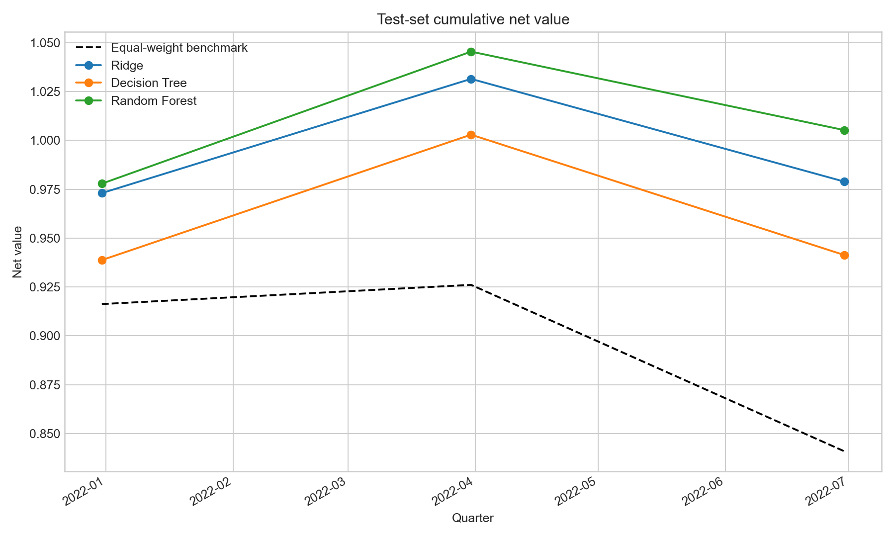
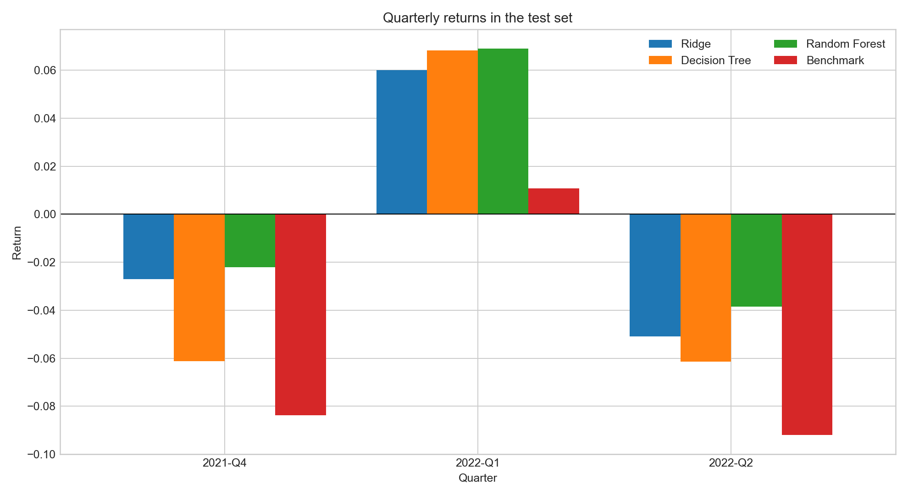
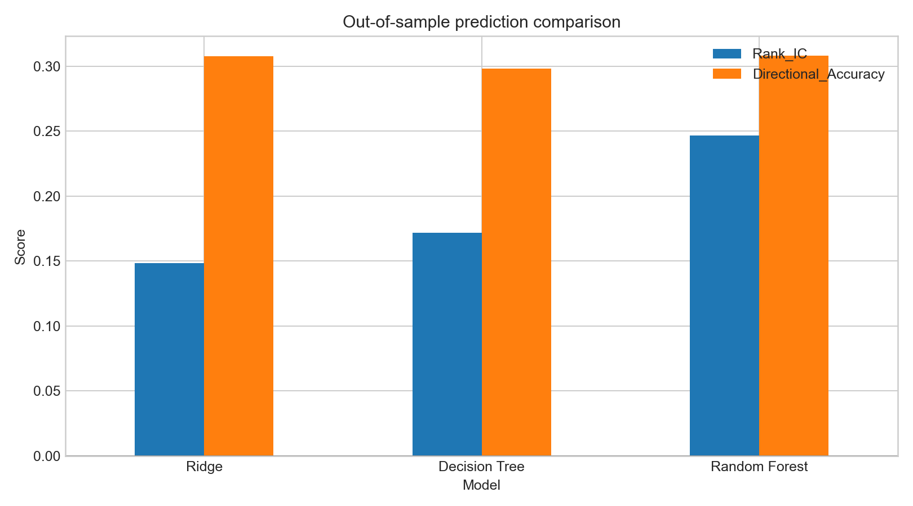

# TASK6：基于机器学习模型的量化交易策略

## 一、机器学习交易策略的核心理念

机器学习交易策略把历史市场信息表示成一组可计算的特征，用历史上已经实现的未来收益训练模型，再用模型对尚未发生的收益、涨跌方向或风险进行预测。预测结果并不直接等于利润，而是需要经过“预测—排序—构建组合—控制成本与风险—回测验证”的完整流程才能形成交易策略。

本作业采用截面选股思路：在每个季度末利用当时可观察到的估值、规模和财务增长因子，预测每只股票下一季度收益率；将股票按预测收益排序，等权买入排名最高的 20%，持有到下一季度。

### 优点

1. 能同时处理大量变量，并发现线性模型不容易捕捉的非线性关系和因子交互。
2. 模型、特征和交易规则可以标准化运行，减少主观情绪影响。
3. 可以通过时间外测试、交叉验证和模型对比量化评价预测能力。
4. 随机森林等集成模型对噪声和单棵树的过拟合通常更稳健，并能输出特征重要性。
5. 同一套流程可以扩展到不同股票池、资产类别、预测周期和风险目标。

### 缺点

1. 金融数据噪声大、信噪比低，历史规律可能因市场状态改变而失效。
2. 随机划分或错误对齐变量容易造成前视偏差和数据泄漏，从而夸大回测结果。
3. 复杂模型容易过拟合，预测误差较低也不一定意味着可交易收益较高。
4. 回测结果受幸存者偏差、复权方式、停牌、涨跌停、流动性和交易成本影响。
5. 树模型和集成模型的经济解释性弱于传统线性因子模型。
6. 参数搜索、股票池选择和回测区间选择本身也可能带来“回测过拟合”。

## 二、常见自变量因子和应变量

### 1. 常见自变量

| 因子类别 | 常见定义 | 经济含义 |
|---|---|---|
| 动量 | 过去 5、20、60 日累计收益 | 上涨或下跌趋势的延续性 |
| 反转 | 最近一期收益的相反数、短期超跌程度 | 短期价格过度反应后的修复 |
| 波动率 | 日收益率在滚动窗口内的标准差 | 价格风险和不确定性 |
| 流动性 | 成交额、换手率、Amihud 非流动性指标 | 交易是否容易及流动性溢价 |
| 估值 | PE、PB、PS、EV/EBITDA、股息率 | 股票价格相对盈利、净资产或收入的高低 |
| 规模 | 总市值或流通市值的自然对数 | 大小盘效应及风险差异 |
| 成长 | 营收、净利润、净资产和 EPS 同比增长率 | 企业基本面扩张速度 |
| 质量 | ROE、毛利率、现金流、资产负债率 | 盈利质量和财务稳健程度 |
| 技术指标 | 均线偏离、RSI、MACD、布林带位置 | 趋势、超买超卖与价格形态 |
| 宏观或行业 | 利率、汇率、通胀、行业虚拟变量 | 系统环境和行业差异 |
| 另类数据 | 新闻情绪、搜索热度、资金流、分析师预期 | 传统行情和财报之外的信息 |

实际建模时，自变量必须在预测时点已经可得。例如用季度财务数据预测下一季度收益时，应考虑财报真实披露日；如果直接按报告期末使用尚未发布的数据，会形成前视偏差。

### 2. 常见应变量

| 类型 | 数学定义示例 | 用途 |
|---|---|---|
| 未来收益率 | \(y_{i,t}=P_{i,t+h}/P_{i,t}-1\) | 回归预测未来收益大小 |
| 超额收益率 | 个股未来收益减市场或行业收益 | 预测相对表现，降低市场方向影响 |
| 涨跌标签 | \(1[y_{i,t}>0]\) | 二分类预测上涨概率 |
| 多分类标签 | 按未来收益分为上涨、震荡、下跌 | 多分类交易信号 |
| 截面分位标签 | 当期未来收益排名前 20% 记为 1 | 直接服务于选股排序 |
| 波动率 | 未来窗口内日收益标准差 | 风险预测与仓位控制 |
| 最大回撤或尾部损失 | 未来窗口最差路径损失 | 风险预警 |

本作业应变量为 `Next_Ret`，定义为样本日期之后一个季度的个股收益率，是连续型回归目标。预测结果主要用于截面排序，因此除 MAE、RMSE 和 R² 外，还重点考察 Spearman Rank IC。

## 三、数据、特征工程与模型设计

### 1. 样本加载

程序加载 `model_data.csv`，共有 39,616 条记录、10 个季度，日期范围为 2020-03-31 至 2022-06-30。每条记录由 `Date` 和 `Code` 唯一标识。

### 2. 原始及衍生自变量

原始变量包括 EV/EBITDA、PB、两类 PCF、两类 PE、PS、股息率、市值，以及净利润、净资产、利润总额、EPS、总资产、现金流、营业利润和营业收入增长率。

在原始变量基础上衍生：

- `log_MV`：\(\log(1+MV)\)，降低市值右偏；
- `earnings_yield`：PE 的倒数，即盈利收益率；
- `book_to_price`：PB 的倒数，即账面市值比；
- `sales_yield`：PS 的倒数，即销售收入收益率；
- `growth_composite`：净利润、营业利润和营业总收入增长率的均值；
- `cashflow_growth_composite`：两项现金流增长率的均值；
- `fundamental_growth_gap`：净利润增长率减营业总收入增长率。

所有因子均在每个季度内部按 1% 和 99% 分位数缩尾并标准化。该处理只使用同一预测时点的股票截面，不使用未来季度信息。

### 3. 训练集、测试集与模型

- 训练集：2020-03-31 至 2021-09-30，7 个季度、26,953 条记录；
- 测试集：2021-12-31 至 2022-06-30，3 个季度、12,663 条记录；
- 岭回归：作为线性基准，使用中位数填充、稳健缩放和 L2 正则化；
- 决策树：最大深度 5，叶节点最少 100 个样本；
- 随机森林：300 棵树，最大深度 8，叶节点最少 30 个样本。

划分以完整季度为单位，不能随机打乱，否则未来季度样本可能进入训练集。

## 四、交易策略与测试集季度收益

每个季度按预测收益从低到高排名，选择排名最高的 20% 股票等权持有。换手率使用相邻两期持仓集合变化估算，并按 `换手率 × 0.1%` 扣除交易成本。基准为测试季度全部股票等权组合。

| 模型 | 2021Q4 | 2022Q1 | 2022Q2 | 测试期累计收益 |
|---|---:|---:|---:|---:|
| 岭回归 | -2.70% | 6.01% | -5.10% | -2.11% |
| 决策树 | -6.12% | 6.84% | -6.14% | -5.87% |
| 随机森林 | -2.21% | 6.91% | -3.84% | **0.52%** |
| 全市场等权基准 | -8.37% | 1.07% | -9.20% | -15.91% |

三个模型在三个测试季度均跑赢等权基准，但绝对收益并非每季度为正。随机森林累计净值最高。

## 五、模型效果与回测核心指标

### 1. 预测效果

| 模型 | MAE | RMSE | R² | Rank IC | 方向准确率 |
|---|---:|---:|---:|---:|---:|
| 岭回归 | 0.1866 | 0.2376 | -0.3262 | 0.1483 | 30.75% |
| 决策树 | 0.1914 | 0.2420 | -0.3759 | 0.1716 | 29.82% |
| 随机森林 | 0.1882 | **0.2375** | -0.3249 | **0.2466** | **30.79%** |

三种模型的 R² 都小于 0，表明准确预测收益绝对值非常困难；但 Rank IC 为正，说明模型仍具有一定的截面排序信息。量化选股更依赖排序而不是精确点预测，因此随机森林的策略表现最好与其最高 Rank IC 相一致。

### 2. 回测指标

| 组合 | 累计收益 | 年化收益 | 年化波动率 | 夏普比率 | 最大回撤 | 正收益季度占比 |
|---|---:|---:|---:|---:|---:|---:|
| 岭回归 | -2.11% | -2.81% | 11.68% | -0.20 | -5.10% | 33.33% |
| 决策树 | -5.87% | -7.75% | 14.98% | -0.48 | -6.14% | 33.33% |
| 随机森林 | **0.52%** | **0.70%** | 11.59% | **0.10** | **-3.84%** | 33.33% |
| 全市场等权基准 | -15.91% | -20.63% | 11.41% | -1.93 | -15.91% | 33.33% |

随机森林的累计收益、夏普比率和最大回撤均优于另外两个模型。其主要重要特征包括 EPS 增长率、盈利收益率、市值、利润总额增长率、净利润增长率和营业利润增长率，说明估值、规模与盈利成长共同影响了模型排序。

## 六、图形

### 测试集累计净值

### 各季度收益率

### 模型预测效果对比

## 七、附加题：自设计随机森林基本面选股策略

附加策略选用本目录的 A 股季度截面样本，自行构造价值、规模、成长和现金流复合因子，以随机森林预测下一季度收益，并选择预测排名前 20% 的股票。测试期扣除换手成本后的累计收益为 0.52%，同期全市场等权基准为 -15.91%，累计超额约 16.43 个百分点。

该结果说明模型在下跌市场中具有一定选股能力，但不能据此断言策略长期有效：测试集只有 3 个季度，年化收益、夏普比率和胜率的统计稳定性都很弱。进一步研究应增加更长历史区间，按真实财报披露日对齐数据，加入停牌和涨跌停约束，并采用滚动训练、行业和市值中性化、参数稳定性检验及多档交易成本压力测试。

## 八、结论

机器学习能够把多个基本面因子组合成非线性的选股评分，但模型预测能力应通过严格的时间外回测判断。本样本中随机森林的 Rank IC 和策略表现最好，决策树次之，岭回归更稳定但非线性表达能力较弱。最终结果更适合视为完整的研究流程演示，而不是可直接投入实盘的收益承诺。

所有数值均由 `analyze_ml_strategy.py` 自动生成，详细逐股票预测、季度收益、模型指标、特征重要性和运行参数见 `output/`。
